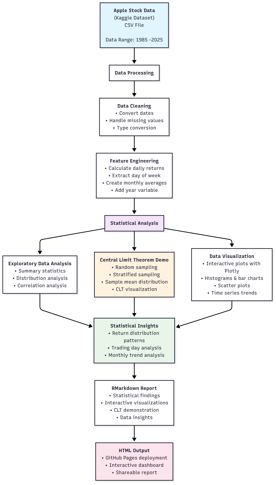

<p align="center">
  
</p>

# AppleStockAnalysis


### Statistical Analysis of Apple Stock Data in R

## Project Overview

This project analyzes Apple's historical stock price data using R to demonstrate statistical concepts and data visualization techniques. It focuses on exploratory data analysis, the Central Limit Theorem demonstration, and comprehensive visualizations of Apple's stock performance patterns.

## Dataset Source

This project uses Apple Inc. stock data retrieved from a public dataset hosted on Kaggle:
[Apple Stock Data 2025 – Umer Haddii](https://www.kaggle.com/datasets/umerhaddii/apple-stock-data-2025)

The dataset includes historical trading data for AAPL from 1980 to 2025, including open/close prices, volume, and other relevant metrics.

## 🔗 Live Report

📊 View the full interactive HTML report hosted on GitHub Pages:
👉 [Apple Stock Analysis Report](https://oohmxi.github.io/AppleStockAnalysis/)

## Technologies Used

- R / RMarkdown
- tidyverse
- lubridate
- ggplot2
- plotly
- readr

## Project Goal

To demonstrate statistical analysis techniques using Apple stock price data with a focus on clear visualizations, reproducible analysis, and educational insights about the Central Limit Theorem and data exploration.

## Statistical Note: Central Limit Theorem

This project includes a demonstration of the Central Limit Theorem (CLT), a fundamental concept in probability and statistics. By simulating repeated samples from Apple's daily returns, the notebook shows how sample means form a normal distribution — demonstrating key statistical principles through practical data analysis.

## Features

- Comprehensive exploratory data analysis of Apple stock data
- Central Limit Theorem demonstration with sampling techniques
- Interactive visualizations of stock trends and distributions
- Statistical analysis of daily returns and price patterns
- Renderable RMarkdown report in HTML/PDF

## About Statistical Analysis

This project demonstrates fundamental statistical concepts using real-world financial data. By analyzing Apple's stock performance, we explore data distributions, sampling theory, and the Central Limit Theorem through practical examples that illustrate how statistical principles apply to financial markets.

## Project Structure

```
AppleStockAnalysis/
├── AppleStockAnalysis.Rmd
├── README.md
├── .gitignore
├── data/
│   └── apple_stock.csv
└── docs/
    └── image/
        ├── system_diagram.md
        └── system_diagram.png
```

## How to Run

1. Open `AppleStockAnalysis.Rmd` in RStudio
2. Knit to HTML or run manually:

```r
rmarkdown::render("AppleStockAnalysis.Rmd")
```

3. Output will be saved in `/docs`

## How This Would Scale

- Add a Shiny dashboard for user interactivity
- Automate data ingestion via Alpha Vantage or Yahoo Finance API
- Deploy as a hosted analysis service with auto-refresh
- Add unit tests and continuous integration
- Modularize statistical analysis functions for reusability

## System Diagram

> **Mobile Friendly:** Embedded as image instead of Mermaid for full compatibility
> 📂 `./docs/image/system_diagram.png`

<p align="center">
  
</p>

## Future Enhancements

- Integrate live stock data via an API (e.g., Alpha Vantage or Yahoo Finance)
- Automate periodic data refresh with scheduled tasks
- Expand analysis to multiple tickers for comparative analysis
- Add a Shiny dashboard for interactive exploration
- Export analysis results and visualizations to CSV and PNG
- Package the analysis functions as a reusable R module in the `/R/` directory
- Add unit tests for helper functions (e.g., data preprocessing, plotting)

## Contact

<p align="center">
  <a href="mailto:ohfreelancing@gmail.com">
    
  </a>
  <a href="https://github.com/oohmxi">
    
  </a>
  <a href="https://linkedin.com/in/omarhlink">
    
  </a>
</p>


<p align="center"><em>In the spirit of Apple—simple, scalable, and slightly ahead of its time.<br>oohmxi</em></p>
