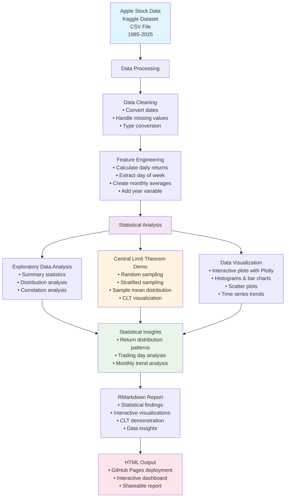

# Apple Stock Analysis System Diagram

## Key Components:

1. **Data Input**: Apple stock CSV data from Kaggle dataset (1985-2025)
2. **Data Processing**: Cleaning, transformation, and feature engineering
3. **Statistical Analysis**: EDA and Central Limit Theorem demonstration
4. **Visualization**: Interactive plots using Plotly
5. **Output**: RMarkdown report with statistical insights

## Technologies Used:
- R/RMarkdown
- tidyverse
- plotly
- lubridate
- ggplot2
